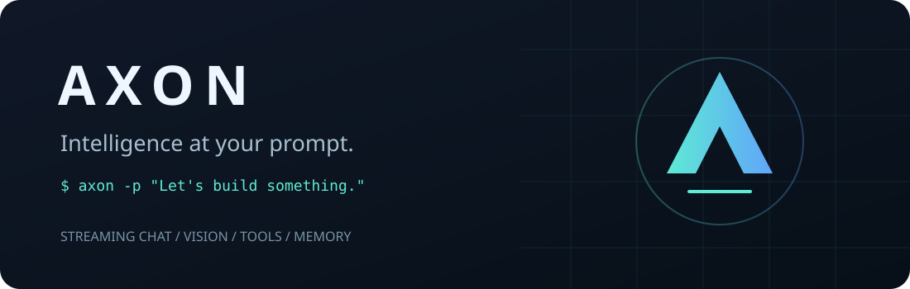

<p align="center"></p>

<p align="center">
  
  
  <a href="LICENSE"></a>
</p>

**A small, capable terminal companion for the Axon API.** Stream a quick answer, keep a long-running
conversation, attach a screenshot, or let Axon work with your files—with your permission.
Linux, Windows, and macOS. One portable file. No runtime dependencies. Bring your own API key.

## Axon 1.8 Flash concept film

A 24-second copper-core 3D ad, with a responsive interactive web edition and original synthesized audio.
[Download the 1080p film](https://github.com/anymousxe/axon-cli/releases/tag/axon-flash-ad-v1)
or [run the interactive edition locally](docs/ad/README.md). The ad is independent of the CLI runtime.

## v1.3 at a glance

| Feature | What you get |
| --- | --- |
| Permission-gated shell | Interactive tools on by default; reads/writes/commands still require approval |
| Rich streamed Markdown | Code, bold, italic, strike, headings, links, lists, quotes, tables and syntax-colored fences |
| Animated gradients | Truecolor hue drift and 12 fps active-only animation; plain/static fallbacks |
| Tabbed inspector | Ctrl+T: session / usage / memory / tools, draft-safe keyboard navigation |
| Completion | Slash commands/args, model names, efforts, image paths and tool-style path tokens |
| Lock-in | Max effort, tools, up to 24 agent rounds, restored settings on exit |
| Compaction | Automatic threshold + `/compact`; six recent turns retained; resumable summaries |
| Everything retained | Thinking, images, chats/resume, memory, cost ledger, themes, dual SSE protocols |

ASCII preview (the live terminal colors the accents and animates while working):

```text
axon > /lockin on
Lock-in ON - max effort - tools on - 24 rounds - approvals still required
[LOCKED-IN] axon-1.8-flash . max . ctx 38% . $0.0042 session
  >1[session] 2[usage] 3[memory] 4[tools]
  Refactor the parser
  Context: ~9120 / 24000 (38%)
  Lock-in: ON . 24 rounds
  Left/Right or 1-4 . q/Esc close . Ctrl+T toggle
```

## Install

Install [Node.js 18+](https://nodejs.org/) first (a current LTS release is recommended).
The following install the versioned npm package from GitHub Releases, **not the npm registry**.
No Git checkout, build tools, or `sudo`-executed installer scripts required.
`--allow-remote=root` explicitly permits this direct download on npm 12+; older npm versions may
warn about the extra option and can omit it.

**Linux — Bash**
```sh
npm install -g --allow-remote=root https://github.com/anymousxe/axon-cli/releases/download/v1.3.0/anymousxe-axon-cli-1.3.0.tgz
```

**Windows — PowerShell**
```powershell
npm install -g --allow-remote=root https://github.com/anymousxe/axon-cli/releases/download/v1.3.0/anymousxe-axon-cli-1.3.0.tgz
```

Then run `axon`. First run opens a hidden-key wizard, validates your key with a tiny **billable** request,
and saves it in your platform's private config directory. `axon login` replaces it later.
If your PowerShell policy blocks npm's `.ps1` shims, use `npm.cmd` and `axon.cmd`.
On Linux, use a user-owned Node installation if your global npm prefix is not writable.

<details>
<summary>Portable single-file installation / running from source</summary>

Download [`axon.mjs`](https://github.com/anymousxe/axon-cli/releases/download/v1.3.0/axon.mjs) and run:

```sh
node /path/to/axon.mjs --help
```

The `.mjs` extension makes it work outside any npm project, including Node 18. The release also includes
SHA-256 checksums. Source install (requires Git):

```sh
npm install -g git+https://github.com/anymousxe/axon-cli.git
```

Or clone and run `node bin/axon.mjs`. The committed bundle needs no build step.
</details>

## Quickstart

```sh
axon                                  # Interactive conversation
axon -p "Explain this project briefly" # One-shot, streamed to stdout
cat error.log | axon -p "Find the cause"
axon -c                               # Continue your last chat
axon -r 20260919T215942-39f63f          # Resume an ID from /chats
axon --model axon-1.8-lightning -p "Summarize this idea"
axon --think high -p "Check this proof carefully"
axon -p "What is wrong with this UI? ./screenshot.png" # Auto-attach image paths
axon -i screenshot.png -p "Describe this"              # Explicit flag still works
axon --no-tools                       # Disable tools (interactive default is on)
axon --tools -p "Run uname -a"        # One-shot tools; TTY approval still required
axon -p "Say hello" --json            # Newline-delimited JSON events
```

PowerShell piping works too: `Get-Content error.log -Raw | axon -p "Find the cause"`.
With no TTY, stdin is one prompt. Use `--repl` to interpret piped lines as separate turns and slash commands.
When `-p` and stdin are both supplied, stdin is appended as clearly delimited context.

### A real conversation

Captured against the **live Axon API** on 2026-09-19. Prompts below are annotated for readability;
the [captured output with obsolete status fields removed](examples/live-transcript.txt) is included. Tiny amounts round to four decimals.

```text
axon › /remember My favorite color is teal
Memory saved for future turns and sessions.

axon › What is my favorite color? Answer in one sentence.
Your favorite color is teal.

2.1s · ~99 in / 7 out tokens · +$0.0000 (estimated)

axon › /cost
Session: $0.0000 · All-time: $0.0000 (includes estimates)
axon-1.8-flash: session $0.0000 / all-time $0.0000 · 99 in / 7 out · 1 requests

axon › /exit
Chat saved: 20260919T215942-39f63f
```

## What feels good

- **Fast by default.** Flash; no extra reasoning effort unless you ask for it.
- **Streamed answers and thinking.** Opt-in reasoning appears in a amber, pulsing `∴ thinking` block.
  Hide its display without changing the requested effort or billing.
- **Useful context.** Persistent memory and complete recent turns, not orphaned tool messages.
  Old chat remains on disk when it leaves the context window.
- **Clear status.** Model · thinking effort · estimated context usage · session cost; ⚡ in fast mode.
  A TTY activity indicator runs while waiting; elapsed time and tokens follow each answer.
- **Paste-anywhere images.** Ctrl+V attaches a clipboard image or inserts text at the cursor.
  Paste or type a local image path to attach it; dim chips show names and dimensions.
- **Images that reach the right model.** Native Flash input or a Flash description passed to a text-only model.
- **Tools you control.** Read, write, edit, list, and run commands. On in interactive chat; off for one-shot/pipes unless requested. No silent approvals.
- **Script-friendly.** Answers on stdout, UI on stderr, NDJSON when requested, friendly error exit codes.
- **Resilient by design.** Ctrl-C cancels without losing the chat; retries for rate limits/server errors;
  raw-key editing with a plain-line fallback, terminal escapes stripped from untrusted output, `NO_COLOR` support.

## Chat commands

| Command | Action |
| --- | --- |
| `/btw <question>` | Lightning side answer, never added to chat messages or future context; usage is still billed and recorded |
| `/fast` | Toggle Lightning + thinking off; toggle again to restore previous settings |
| `/compact [auto\|off]` | Compact older history with Lightning; keep six recent turns; toggle automatic compaction |
| `/lockin [on\|off]` | Max effort + tools + 24-round agent loop; off restores prior settings |
| `/panel [session\|usage\|memory\|tools]` | Tabbed inspector (also Ctrl+T) |
| `/retry` | Replace the last user turn and its replies with a fresh response; old transcript stays on disk |
| `/copy` | Copy the last assistant answer via `wl-copy`, `xclip`, `clip.exe`, or `pbcopy` |
| `/usage` | Detailed per-model input/output tokens, request counts, session and all-time cost |
| `/status` | Version, model, effort, masked key, context estimate, session ID, theme and cost |
| `/theme dark\|light\|auto` | Persist the terminal palette; auto uses `COLORFGBG` when available, otherwise dark |
| `/hide-thinking` | Toggle reasoning display without changing effort or billing |
| `/model [name]` | List models or switch; save as the new default |
| `/think off\|low\|medium\|high\|max` | Select reasoning effort; `off` omits it from requests |
| `/think show\|hide` | Show/hide reasoning text |
| `/img [path]` | Queue an image from a file or the clipboard |
| `/imgs` | List pending image chips with names and dimensions |
| `/images clear` | Clear queued images without changing prompt text |
| `/tools on\|off` | Enable tools or disable and clear session approvals |
| `/cost` | Session and all-time totals with per-model breakdown |
| `/remember <text>` | Add a timestamped persistent memory |
| `/memory` · `/forget <n>` | List numbered memories / remove one |
| `/chats` · `/resume <id>` | List recent chats / resume one |
| `/title <text>` | Rename the current chat |
| `/clear` | Clear active context, retaining the transcript and memory |
| `/new` | Start a fresh session |
| `/help` · `/exit` | Help / save and leave |

CLI settings flags apply to that invocation. Model, effort, thinking visibility, and theme commands persist. `/fast` is temporary and restores the previous model/effort when toggled off.
Use `//` to send a prompt beginning with a literal slash. Ctrl-D exits on empty input; Ctrl-C cancels an active
request, or twice at an idle prompt exits. Double-Esc also interrupts an active request. The editor uses raw keys on capable TTYs, with a plain-line fallback for dumb terminals, legacy Windows consoles, and piped input.

## Command menu and terminal styling

Type `/` or `/prefix` at the prompt to open a fuzzy-filtered menu **above** the input.
Use ↑/↓ to select, Tab or Enter to complete, then Enter again to execute. Esc dismisses.
After completing `/model `, press Tab again to open the model argument menu with input/output
prices. `/think `, `/resume `, `/theme `, `/tools `, `/lockin `, `/compact `, `/panel ` and `/images ` also complete arguments. `/img ` completes local paths (including spaces); Tab also completes path tokens in free text and JSON-style tool arguments.
Command matching starts at the beginning of the prompt; slashes inside ordinary prose do not
hijack typing. Bracketed paste is inserted as text, including multiline text, never executed
as a batch of commands. Home/End, arrows, Backspace/Delete and Ctrl-A/E/U/K/W work.
Ctrl-L clears and redraws the screen. ↑ on empty input recalls prior turns; ↓ returns to your draft.
Ctrl-U clears text to the cursor, **not attachments**. `/help` and the dropdown share one command table.
Status, menus, chips and the editor clip by terminal cells, including CJK and emoji, on narrow screens.
Permission prompts and hidden key entry never show command suggestions.

Illustrative terminal sample (the actual UI colors these lines):

```text
  ϟ AXON 1.2.0

axon-1.8-flash · off · ctx 2% · $0.0004 session
› /model   List or switch models
  /memory  List persistent memories
axon › /m

∴ thinking 1.2s                         [amber pulse]
┌─ js ──────────────
│ const answer = await axon.chat("Hello");
└────────────────────
--- a/hello.js
+++ b/hello.js
@@ -1,1 +1,1 @@
-oldValue                               [red]
+newValue                               [green]
✓ complete
```

Ice-blue accents work on deep-space backgrounds; light mode uses darker, higher-contrast
accents. Streamed answers, `/btw`, and tool summaries render Markdown: inline code with an
accent background, bright bold, italic, dim strikethrough, underlined gradient headings,
colored list bullets, quotes, links, aligned tables, and rules. JS/TS, Python, JSON, SQL,
Bash/sh, Go, Rust, C/C++ and Java fences get dependency-free lexical highlighting.
Write/edit tools still show unified diffs after approved changes.

Truecolor terminals get hue-drifting startup, activity, streaming caret, lock-in and
compaction accents at about 12 fps. Lock-in task completion gets a short sparkle burst.
Animation timers stop when idle; the prompt's gradient stays frozen until the next redraw.
Oversized in-flight Markdown lines/tables use a clipped preview and print fully on completion.

`NO_COLOR` disables colors **and animation** (but retains keyboard menus on capable TTYs).
`TERM=dumb` and non-TTY output are plain; redirected answers keep their original Markdown.
256-color terminals use static colors. Windows Terminal supports ANSI/truecolor, while legacy
Windows consoles use plain-line input. JSON output has no styled answers or animations.
Unicode width can vary by terminal; the prompt scrolls horizontally rather than wrapping input.
Set `COLORTERM=truecolor` only if your terminal supports 24-bit color.

### Inspector and lock-in

Press **Ctrl+T**, or enter `/panel`, at the chat prompt. **←/→** or **1–4** switches
session, usage, memory and tools tabs; **q/Esc** closes without losing your draft.
The panel shows current context, session/all-time cost, compaction count/savings, memory,
permission grants, and lock-in state. It refreshes when opened or navigated; it does not
run a background polling timer or intercept permission prompts. `/panel usage` also prints
plain values in a piped REPL. Existing session titles appear in the session tab.

`/lockin on` sets effort to `max`, enables tools, and continues tool/model rounds until
a final answer with no tool calls, cancellation, the 24-round cap, or the five-minute turn
timeout. It **does not bypass permission approval**. `/lockin off` restores the previous
effort/tools state. Effort, fast mode and tools-off changes are blocked while locked;
turn it off first. Markers persist in chat JSONL, and interactive resume restores lock-in
unless `--no-tools` is given. Approval grants themselves never persist.

### Automatic and manual compaction

`/compact` summarizes older turns with `axon-1.8-lightning`, keeping the latest **six user
turns and all their assistant/tool messages verbatim**. If fewer than seven turns exist,
it reports that there is nothing old enough to compact. `/compact auto` enables automatic
compaction (default); `/compact off` disables it for the process. Auto-compaction checks
projected context before a turn and between completed tool rounds.

The default threshold is **80% of the conservative 24,000-token local input budget**.
Server model windows are not published here, so this is deliberately not a claim about
actual maximum model context. Usage-ledger prompt/output tokens plus local growth inform
the projection; lifetime usage is never mistaken for context usage.
`AXON_COMPACT_THRESHOLD=0.8` or `80` overrides the threshold (`0.001` is useful for testing).

Compaction is billable and lossy. Full transcripts remain on disk; older active history is
replaced only after a successful, nonempty, smaller summary. Errors leave it untouched.
Bounded summarization excludes image bytes; discuss important visual details first.
Summary, retained messages and savings are persisted atomically as one JSONL compaction
marker so resume reconstructs the same context. `/clear` removes active summary/messages,
not persistent memory or transcript records. Savings are estimates. If recent turns alone
exceed the local budget, compaction cannot shrink them; shorten the prompt or `/clear`.

## Vision

```text
axon › /img ./screenshot.png
Queued 1 image(s). Add your prompt next.
axon › Explain this layout.
◈ Image route: native → axon-1.8-flash (1 image)
```

- **Flash:** PNG/JPEG/GIF/WebP bytes are sent as base64 multimodal content.
- **Lightning, 1.6, 1.6 Pro:** Flash first describes the image precisely; that description is then
  injected as explicitly untrusted context for the chosen text-only model. Both requests count toward cost.
- Switching a native-image conversation to a text-only model also routes retained images through Flash.
### Paste an image—no command needed

1. Copy an image, focus Axon, and press **Ctrl+V**. In raw-key mode Axon reads the system clipboard:
   images become chips; text is inserted at the cursor, with multiline text kept as **one turn**.
2. Or paste/drag/type an existing `.png`, `.jpg`, `.jpeg`, `.gif`, or `.webp` file path. Paths inside
   a prompt attach too: `Explain "./screenshots/my layout.png"`. Quoted and shell-escaped paths,
   whole-line paths with spaces, `~/` paths, and local `file://` URIs are supported.
3. Add your question and press Enter. Enter on an empty prompt sends the queued images for description.
   A path entered by itself becomes a chip first, so you can add a question before sending.

```text
[img 1 · clipboard · 1170x1969]
axon › What would you improve here?
```

- `/imgs` lists pending images; `/images clear` removes all. Ctrl-U only edits text.
- `/img [path]` still works; omit the path to read a clipboard image explicitly.
- **Linux:** install `wl-clipboard` for Wayland or `xclip` for X11; Wayland is tried first.
- **Windows:** PowerShell `Get-Clipboard` reads image or text; no extra clipboard utility is required.
- **macOS:** install `pngpaste` for images (`brew install pngpaste`); `osascript` handles text.
- If the terminal intercepts Ctrl+V, use its text-paste shortcut to paste a file path, or configure it
  to send Ctrl+V to the application. No terminal protocol can make a terminal's text-only paste
  transmit image bytes. Missing clipboard tools or raw-mode support produce guidance, not a crash.
- One-shot prompts auto-attach paths too: `axon -p "Describe ./screenshot.png"`, or
  `printf '%s\n' './screenshot.png' | axon`. `--repl` intentionally keeps piped lines as separate
  turns; a path-only line queues an attachment for the next prompt (or a blank line to send).
- Files are validated by magic bytes and capped at **10 MiB each**. Missing/unsupported paths remain
  literal text; `/img <path>` reports explicit file errors. Repeated `-i` remains supported.
- Clipboard reads are on demand, bounded and shell-free. Images are not sent until you submit.

Native image payloads are stored in local chat JSONL; description-routed chats store the description.
There is no separate image upload service.

## Tools and permissions

Plain interactive `axon` exposes five OpenAI-compatible functions. `--no-tools` disables them.
One-shot and piped input keep tools off unless `--tools` is passed; `/tools on` enables them
in a REPL, but non-TTY approval always fails closed:

| Tool | Behavior |
| --- | --- |
| `run_command` | Bash on Linux; PowerShell by default or `cmd` on Windows; 30-second timeout |
| `read_file` | Read a UTF-8 file, bounded to 64 KiB |
| `write_file` | Write/overwrite a UTF-8 file, create parent directories |
| `edit_file` | Replace one exact occurrence in a UTF-8 file (fails on ambiguous matches) |
| `list_dir` | List up to 500 directory entries |

Each action asks: **y / n / always-for-session / always-for-cmd** (`a` and `c` are shortcuts).
“Always for cmd” matches the exact tool and arguments, not a dangerous prefix wildcard. Grants disappear
when you exit or turn tools off. Non-TTY requests cannot approve tools and are denied automatically.
There is deliberately no `--yes` switch. Outputs are truncated for display and bounded in model context;
the loop stops after eight rounds per user turn, or 24 in lock-in mode.

**Live API compatibility:** the current endpoint returns function calls in non-streaming JSON, but drops
them from SSE. Tool-enabled rounds therefore use JSON requests; ordinary chat and vision remain streamed.
The same OpenAI function-call loop handles both response formats. The UI still shows activity while waiting.

Tools run with **your user privileges**, not in a sandbox. Read the [security guide](SECURITY.md) before
allowing broad access. Never approve a command just because the model says it is safe.

## Models and cost

Prices in USD per **1 million** tokens:

| Model | Input | Output | Images |
| --- | ---: | ---: | --- |
| `axon-1.6` | $0.05 | $0.15 | Flash description |
| `axon-1.6-pro` | $0.15 | $0.40 | Flash description |
| **`axon-1.8-flash`** (default) | **$0.10** | **$0.30** | **Native** |
| `axon-1.8-lightning` | $0.03 | $0.08 | Flash description |

All models default to **fast pass**: `reasoning_effort` is omitted. Opt in with `--think` or `/think`.

When present, response usage is authoritative. The live SSE endpoint may omit usage; Axon then uses a
clearly marked character-based estimate (~4 characters/token, with an image allowance). Reasoning and
all model/tool rounds contribute. Actual wallet charges may differ, particularly for images, reasoning,
and interrupted requests. Prices are a local table, not a wallet balance query.

`/btw` and `/compact` charges are included in the session ledger.

`usage.jsonl` is an append-only ledger, with a `usage.json` summary. `/cost` rebuilds from the ledger so
parallel processes do not lose entries. There is no migration from an arbitrary third-party usage file.

## Config, authentication, and privacy

| Platform | Default directory |
| --- | --- |
| Linux / macOS | `$XDG_CONFIG_HOME/axon` or `~/.config/axon` |
| Windows | `%APPDATA%\axon`, falling back to `%USERPROFILE%\.axon` |

| Variable | Purpose |
| --- | --- |
| `AXON_API_KEY` | Overrides the stored key; never written to config automatically |
| `AXON_BASE_URL` | API prefix or full completions URL; receives your key, so only use trusted servers |
| `AXON_CONFIG_DIR` | Override the whole config directory (useful for isolated projects/tests) |
| `NO_COLOR` | Disable ANSI styling |

Default URL: `https://axon-chat-nu.vercel.app/api/v1/chat/completions`.
`axon whoami` reports credential source and local paths **without printing the key**; it is not an account
identity or a fresh validation request. `axon logout` removes the saved key, not your shell's environment.

Config contains `config.json`, `chats/*.jsonl`, chat title sidecars, `last-chat`, `memory.md`, `usage.jsonl`,
and `usage.json`. Files are plaintext; Unix config files are private (`0600`, directory `0700`). Windows
uses your profile ACLs. There is **no telemetry or background update check**.

Memory keeps the newest ~8,000 characters (~2k estimated tokens). The local context input budget is
24,000 estimated tokens, **not a claim about the server's maximum window**. Trimming removes oldest whole
turns and always retains the generated system prompt and memory. Oversized single turns are rejected.

## JSON and exits

```sh
axon -p "Say hello" --json
```

Stdout is NDJSON: `delta`, `reasoning` (when visible), `image_route`, `tool`, and a final `result`, or
`error` / `cancelled`. REPL mode also emits `session`, `notice`, `attachments`, `usage`, `btw`, and `compact` events; approved file changes can emit `diff`. `result` includes:
`session_id`, `text`, `elapsed_seconds`, `usage`, `cost`, `session_cost`, and `context_percent`.
No banner or ANSI escapes are written to JSON stdout. Extract only `type == "result"` for the whole answer.

Exit codes: **0** success, **1** configuration/API failure, **130** cancelled one-shot. An interactive
request failure leaves the REPL open. Tools may return a denied/failed result without failing the whole chat.

## Development and verification

```sh
npm run check          # Build + unit tests + offline end-to-end smoke checks
npm run smoke:live     # Opt-in, billable: saved login key or AXON_API_KEY
npm run smoke:terminal # Opt-in, billable Linux PTY: uname approval + forced compaction
npm pack               # Build the installable npm tarball
```

Verified during release preparation on Linux with Node **18.20.8** and **26.8.2**:
- **52 unit/protocol/PTY tests:** pricing, storage, paths, SSE fragmentation, permissions, cancellation,
  early EOF, retry behavior, JSON tool parsing, rendering, capabilities, autocomplete, compaction,
  side-question isolation, retry persistence, clipboard fallbacks, image dimensions/path extraction,
  cursor insertion and async-paste ordering, Unicode cell clipping, and actual PTY interaction.
- **11 offline end-to-end checks:** real subprocess CLI, local HTTP fixture, image routing, permission denial,
  echo execution, memory across processes, continue/resume, and persisted costs.
- **9 live API smoke checks:** chat, piped/streamed REPL, memory, both image routes, resume, actual echo tool,
  and usage accounting. No credentials are in this repository.
- **Live v1.3 PTY checks:** plain `axon` with no `--tools`, `uname -a`, real `y` approval,
  Linux output/exit 0 and model follow-up; forced auto-compaction at a tiny threshold,
  post-summary ORCHID recall, savings and last-six-turn JSONL resume verification.
- **Automated Linux PTY checks:** menu placement, completion, resize, multiline bracketed paste,
  Ctrl+V image/text via a controlled clipboard executable, chips, Ctrl-L, double-Esc,
  hidden input, EOF, and terminal-mode restoration. Prior v1 live checks covered login and tool approvals.
- A [CI workflow template](.github/ci-template.yml) targets Node **18, 22, and 24** on **Linux and Windows**.
  It is **not active**: the publishing login lacks GitHub workflow scope. Move it to
  `.github/workflows/ci.yml` using a workflow-authorized account to enable it. Windows/macOS runtime and
  real desktop clipboard integration have **not** been verified in this release environment;
  provider responses and fallback paths are covered by controlled tests.

See [CONTRIBUTING.md](CONTRIBUTING.md). The source is intentionally small: `api`, `storage`, `images`,
`tools`, `engine`, `agent`, `input`, `ui`, `render`, `commands`, `clipboard`, `paths`, `models`, and `cli`. A deterministic, dependency-free build script
emits the standalone executable.

## Roadmap

- Cache historical image descriptions when switching models.
- Optional OS keychain storage and encrypted chat export.
- Richer multiline editing and search without compromising fallback terminals.
- Server-reported context limits and exact image/reasoning billing when the API exposes them.
- Streaming tool rounds once the live endpoint preserves function-call deltas.
- npm registry distribution when publishing credentials are configured.

MIT licensed. This is a community CLI, not an assertion of affiliation with the Axon API operator.
